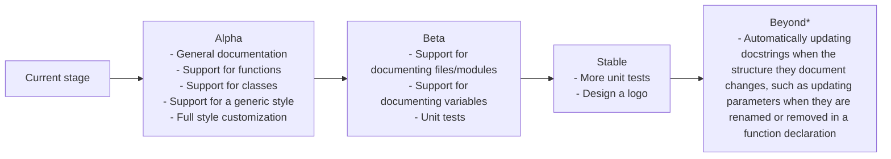

# codedocs.nvim

<p align="center">
    
    
    
    <a href = "https://github.com/jeangiraldoo/codedocs.nvim/blob/main/LICENSE" alt="Licensed under MIT">
        
    </a>
    
</p>

Codedocs.nvim automatically recognizes various language structures such as functions, classes, variables, and more, and inserts appropriate documentation strings based on the [programming language](#supported-languages) you are using.

You can easily modify the structure of the documentation strings to suit your specific needs, add support for new languages by defining their documentation formats, or just use codedocs as it is! :)

# Table of contents
- [Features](#features)
- [Requirements](#requirements)
- [Installation](#installation)
- [Configuration](#configuration)
- [Usage](#usage)
- [Supported languages](#supported-languages)
- [Roadmap](#roadmap)
- [Codedocs under the hood](./lua/codedocs/README.md)
- [Contributing](#contributing)
- [Motivation](#motivation)
- [License](#license)

### Features

- Automatic Recognition: Detects and documents the structure under the cursor using a keybind.
- Multi-Language Support: Generates documentation strings for various programming languages.
- Customizable Structures: Modify existing documentation formats or define new ones for additional languages.

### Requirements

Codedocs relies on Treesitter for its core functionality. The easiest way to install Treesitter parsers is by using [nvim-treesitter](https://github.com/nvim-treesitter/nvim-treesitter). Simply install **nvim-treesitter** and the parsers for the programming languages you use, and you're ready to install Codedocs.

If you already have the Treesitter parsers you want installed, you can proceed with installing Codedocs directly.

### Installation

To install Codedocs with your plugin manager, follow the instructions for the relevant manager below:


#### [lazy.nvim](http://www.lazyvim.org/)
```lua
{
    "jeangiraldoo/codedocs.nvim"
}
```

#### [packer.nvim](https://github.com/wbthomason/packer.nvim)
```lua
use {
    "jeangiraldoo/codedocs.nvim"
}
```

### Configuration

Configuring Codedocs is not mandatory, as it works out of the box. However, if the default settings don’t meet your needs, you can easily customize the plugin.

#### Change the default docstring style used in a language

You can change the docstring style for any language that supports more than one style.

Keep in mind that the name of the docstring style must be spelled exactly as shown in the table of [supported languages](#supported-languages). For example, `reST` must be written as `reST` (not `ReST` or any other variation).

Although this example demonstrates changing the style for a single language, you can customize as many languages as you want by adding their names to the table and assigning the respective style names.

In this case, we are changing Python's docstring style from the default to "reST":

```lua
require("codedocs").setup {
    default_styles = {python = "reST"}
}
```

### Usage

When your cursor is placed on top of a language's structure (e.g., a function declaration, class, etc.) that you want to document and you trigger the docstring insertion, Codedocs will check if it has a [docstring style for such structure in the programming language you are using](#supported-languages). If a docstring style is available, it will generate and insert a docstring above or below the structure, depending on the language's docstring style.

If the structure under the cursor isn't supported by Codedocs, an empty single-line comment will be inserted.

You can start the docstring insertion either by using a command or a keymap:

##### Command:

Codedocs creates the `:Codedocs` command, which can be called manually like this:

```lua
:Codedocs
```

##### Keymap:

For a more convenient experience, you can bind the docstring insertion to a keymap. For example:

```lua
vim.keymap.set("n", "<leader>k", require('codedocs').insert_docs, { desc = "Inserts a docstring into the buffer" })
```
This keymap will insert a docstring when pressing ```<leader>k```. Feel free to customize the key combination to your liking.

### Supported languages

This section lists the languages supported by Codedocs, along with the supported annotation styles and the automatic annotations that can be inserted into the documentation for each language.

Feel free to create your own custom styles if the options provided here don't meet your needs! :)

| Languages | Annonation styles | Supported automatic annotation |
|----------|----------|----------|
| Lua | [LDoc](#lua-ldoc) | `function (parameters, return)` |
| Python | [Google](#google), [NumPy/SciPy](#numpy-scipy), [reST](#restructuredtext-rest) | `class (attributes)`, `function (parameters, return)` |
| JavaScript | [JSDoc](#javascript-jsdoc) | `class (attributes)`, `function (parameters, return)` |
| TypeScript | [TSDoc](#typescript-tsdoc) | `class (attributes)`, `function (parameters, return)` |
| Ruby | [YARD](#ruby-yard) | `function (parameters, return)` |
| PHP | [PHPDoc](#php-phpdoc) | `function (parameters, return)` |
| Java | [JavaDoc](#java-javadoc) | `class (attributes)`, `function (parameters, return)`
| Kotlin | [KDoc](#kotlin-kdoc) | `class (attributes)`, `function (parameters, return)` |
| Rust | [RustDoc](#rust-kdoc) | `function (parameters, return)` |

#### Styles per language:

Below are examples of the docstring styles for different languages under various conditions.

Keep in mind that the information displayed in the docstring may vary depending on the following circumstances:

- Return type annotation: A return section will only be added if Codedocs detects a return type in the function declaration or finds a return statement anywhere within the function's body.
- Parameter type: The parameter type will only be included if specified through a type hint or if the language is statically typed. The parameter name, however, will always be included, regardless of type.

##### Lua (LDoc):
[Official LDoc documentation](https://lunarmodules.github.io/ldoc/manual/manual.md.html#Introduction)

```lua
--- <title goes here>
-- @param a
-- @param b
-- @return
local function cool_function(a, b)
    <code goes here>
    return <value>
end
```

##### JavaScript (JSDoc):
[Official JSDoc documentation](https://jsdoc.app/)

```javascript
/*
 * <title goes here>
 *
 * @param {} a
 * @param {} b
 * @returns
 */
function cool_function(a, b){
    <code goes here>
    return <value>
}
```

##### TypeScript (TSDoc):
[Official TSDoc documentation](https://tsdoc.org/)

```typescript
/*
 * <title goes here>
 *
 * @param a -
 * @param b -
 * @returns
 */
function cool_function(a: number, b: string): number{
    <code goes here>
    return <value>
}
```

##### Python:

- Google:

[Official Google documentation for Python](https://google.github.io/styleguide/pyguide.html#38-Comments-and-Documentation)

```python
def cool_function_with_type_hints(a: int, b: bool) -> str:
    """
        <title goes here>

        Args:
            a (int):
            b (bool):
        Returns:
            str:
    """
    <code goes here>
    return <value>

def cool_function_without_type_hints(a, b):
    """
        <title goes here>

        Args:
            a ():
            b ():
        Returns:
    """
    <code goes here>
    return <value>
```

- NumPy/SciPy:

[Official Numpy documentation for Python](https://numpydoc.readthedocs.io/en/latest/format.html#docstring-standard)

```python
def cool_function_with_type_hints(a: list, b: str) -> bool:
    """
        <title goes here>

        Parameters
        ----------
        a : list
        b : str

        Returns
        ------
        bool
    """
    <code goes here>
    return <value>

def cool_function_without_type_hints(a, b):
    """
        <title goes here>

        Parameters
        ----------
        a :
        b :

        Returns
        ------
    """
    <code goes here>
    return <value>
```

- reStructuredText (reST):

[Official reST documentation for Python](https://docutils.sourceforge.io/rst.html)

```python
def cool_function_with_type_hints(a: list, b: str) -> bool:
    """
        <title goes here>

        :param a:
        :type a: list
        :param b:
        :type b: str
        :return:
        :rtype: bool
    """
    <code goes here>
    return <value>

def cool_function_without_type_hints(a, b):
    """
        <title goes here>

        :param a:
        :type a:
        :param b:
        :type b:
        :return:
        :rtype:
    """
    <code goes here>
    return <value>
```

##### Ruby (YARD):

[Official YARD documentation for Ruby](https://rubydoc.info/gems/yard/file/docs/GettingStarted.md#documenting-code-with-yard)

```ruby
 # <title goes here>
 #
 # @param a []
 # @param b []
 # @return
def cool_function(a, b)
    <code goes here>
    return <value>
end
```

##### PHP (PHPDoc):

[Official PHPDoc documentation for PHP](https://docs.phpdoc.org/guide/getting-started/what-is-a-docblock.html#what-is-a-docblock)

```php
/**
 * <title goes here>
 *
 * @param int $a
 * @param int $b
 * @return bool
 */
function cool_function_with_type_hints(int $a, int $b): bool {
    <code goes here>
    return <value>
}

/**
 * <title goes here>
 *
 * @param $a
 * @param $b
 * @return
 */
function cool_function_without_type_hints($a, $b) {
    <code goes here>
    return <value>
}
```

##### Java (JavaDoc):
[Official JavaDoc documentation](https://www.oracle.com/technical-resources/articles/java/javadoc-tool.html#format)

```java
/*
 * <title goes here>
 *
 * @param a
 * @param b
 * @return
 */
public void cool_function(int a, String b){
    <code goes here>
    return <value>
}
```

##### Kotlin (KDoc):
[Official KDoc documentation](https://kotlinlang.org/docs/kotlin-doc.html)

```kotlin
/*
 * <title goes here>
 *
 * @param a
 * @param b
 * @return
 */
fun cool_function(a: Int, b: String): Boolean {
    <code goes here>
    return <value>
}
```

##### Rust (RustDoc):
[Official RustDoc documentation](https://doc.rust-lang.org/rust-by-example/meta/doc.html)

```rust
/// <title goes here>
///
/// # Arguments
///
/// * `a`
/// * `b`
///
/// # Returns
///
fn add(a: i32, b: i32) -> i32 {
    a + b
}
```

### Roadmap

This diagram outlines the features and improvements planned for the project at different stages. Please note that this roadmap is flexible and will be updated as the project evolves, reflecting its current state at any given time.



*Beyond: Refers to all the features planned for Codedocs after the plugin reaches a stable and mature state. They will be appropriately split into stages when the moment comes.

### Contributing

Thank you for your interest in contributing to **Codedocs**! There are several ways you can help improve the project:

- **Propose new features**: If you have an idea for a new feature, please open a discussion in the [Discussions section](https://github.com/jeangiraldoo/codedocs.nvim/discussions).
- **Contribute to feature development**: You can help by working on features listed in the [Roadmap](#roadmap). For a deeper understanding of the codebase, check out the [documentation explaining how Codedocs works under the hood](./lua/codedocs/README.md).
- **Report or fix bugs**: If you encounter a bug, you can report it by creating a new discussion or GitHub issue. If you're able to fix the bug yourself, your help in resolving it is greatly appreciated!
- **Enhance the documentation**: If you spot any typos, outdated information, or areas where the documentation could be clearer, feel free to suggest improvements.

Every contribution, no matter how big or small, is valuable and highly appreciated!


### Motivation

I started workng on Codedocs because I wanted to enhance my experience with Neovim, which I started using daily for my side projects and university assignments. I wanted a tool to make documenting my code easier and to contribute something useful to the community! :D

While I found a few plugins with similar functionality, none of them offered the level of customization and simplicity I was looking for. Sometimes, I feel that apps and plugins could be more intuitive and user-friendly while still providing the same powerful features.

TL;DR: I built Codedocs to improve productivity by automatically generating documentation strings, allowing for easy customization, and providing a simple yet powerful solution for both personal and community use. Plus, it is a fun project to work on!

### License

Codedocs is licensed under the MIT License. This means you are free to download, install, modify, share, and use the plugin for both personal and commercial purposes. The only requirement is that if you modify and redistribute the code, you must include the same LICENSE file found in this repository.
