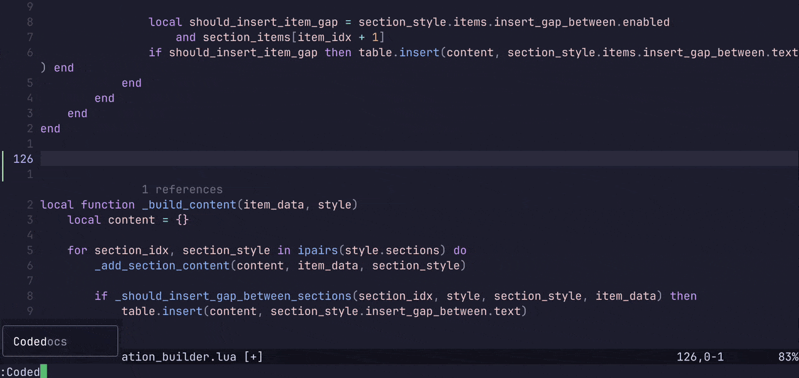

<!-- markdownlint-disable-next-line MD041 MD033 -->
<div align="center">

# codedocs.nvim

_A simple, customizable, yet powerful Annotation
Framework_

</div>



Codedocs.nvim automatically recognizes various code targets such as functions,
classes, variables, and more, and inserts appropriate documentation strings based
on the [programming language](#language-support) you are using.

You can easily modify the structure of the annotations to suit your specific needs,
add support for new languages by defining their documentation formats, or just use
codedocs as it is! :)

<!-- markdownlint-disable-next-line MD033 -->
<div align="center">


</div>

## 📖 Table of contents

- [Features](#features)
- [Requirements](#requirements)
- [Installation](#installation)
- [Configuration](#configuration)
- [Usage](#usage)
- [Language support](#language-support)
- [Annotation examples](#annotation-examples)
- [Roadmap](#roadmap)
- [Contributing](#contributing)
- [Motivation](#motivation)
- [License](#license)

## Features

- Works out-of-the-box.
- Detects and documents code targets with a simple keybind.
- Supports multiple [languages and styles](#language-support).
- Easily customize existing formats or add new ones.
- Annotations use Neovim's built-in snippet engine.

## Requirements

Codedocs relies on Treesitter for its core functionality. Neovim includes
built-in Treesitter parsers for the following languages—meaning no extra setup
is needed for:

- Lua
- C

For any other language, you'll need to install the corresponding Treesitter
parser. The simplest way to do this is with
**[nvim-treesitter](https://github.com/nvim-treesitter/nvim-treesitter)**.

## Installation

> [!WARNING]
> Development is done using [Trunk Based Development](https://trunkbaseddevelopment.com),
> meaning all new changes are merged into `main`, making it the equivalent of `nightly`;
> versions are done through Git tags.
>
> All changes are thoroughly tested before merging, but it is still recommended
> to pin to a specific tag unless you wish to be constantly up to date.

Use the snippet for your plugin manager:

### [vim.pack](https://neovim.io/doc/user/pack.html#vim.pack)

```lua
vim.pack.add({
    { src = "https://github.com/jeangiraldoo/codedocs.nvim" }
})
```

### [lazy.nvim](http://www.lazyvim.org/)

```lua
{
    "jeangiraldoo/codedocs.nvim",
}
```

### [packer.nvim](https://github.com/wbthomason/packer.nvim)

```lua
use {
    "jeangiraldoo/codedocs.nvim",
}
```

### [vim-plug](https://github.com/junegunn/vim-plug)

```vim
Plug 'jeangiraldoo/codedocs.nvim'
```

### [mini.deps](https://github.com/echasnovski/mini.deps)

```lua
require("mini.deps").add({
    source = "jeangiraldoo/codedocs.nvim",
})
```

### [minpac](https://github.com/k-takata/minpac)

```vim
packadd minpac
call minpac#add('jeangiraldoo/codedocs.nvim')
```

### [paq-nvim](https://github.com/savq/paq-nvim)

```lua
require("paq") {
    "jeangiraldoo/codedocs.nvim",
}
```

## Configuration

> [!WARNING]
> Language, annotation and style names must be spelled exactly as shown in the
> [supported languages section](#language-support).

All options can be customized using the setup function. Here are most of the
default options:

```lua
require("codedocs").setup {
    debug = false,
    languages = {
        --- This table is too big to be displayed here
        --- The path to the config file is `codedocs/config/init.lua`
    },
    aliases = {
        sh = "bash"
    }
}
```

### Change a language's default style

Default styles are defined using the `default_style` key. For example, let's set
the default styles for Python and Lua:

```lua
require("codedocs").setup {
    languages = {
        python = {
            default_style =  "reST"
        },
        lua = {
            default_style = "EmmyLua"
        }
    },
}
```

### Customize an annotation

You can customize almost (for now!) every aspect of an annotation. Whether you
want to make a simple change, like modifying the characters wrapping the parameter
type:

```python
def cool_function_with_type_hints(a: int, b: bool) -> str:
    """
    <title goes here>

    Args:
        a <int>:
        b <bool>:
    Returns:
        str:
    """
    self.sum = 1 + 1
    return <value>
```

Or if you want to go all out with customization:

```python
def cool_function_with_type_hints(a: int, b: bool) -> str:
        """
        <title goes here>

        Some cool customized title!:
            a (づ ◕‿◕ )づ int ⊂(´• ω •`⊂):

            b (づ ◕‿◕ )づ bool ⊂(´• ω •`⊂):
        This is some return type...:
            (￢_￢;) str:
        """
        self.sum = 1 + 1
        return <value>
```

In this case, we:

- Increased spacing between items in the parameters block.
- Wrapped parameter types with two [Kaomojis](https://kaomoji.ru/en/).
- Added a third kaomoji to wrap the left side of the return type.
- Customized the titles for both the parameters and return blocks.

To customize an annotation, keep in mind that it is simply a regular Lua
table with the following options:

| Option Name         | Expected Value Type                                 | Behavior                                          |
| ------------------- | --------------------------------------------------- | ------------------------------------------------- |
| `relative_position` | `"above"` \| `"below"` \| `"empty_target_or_above"` | Where to insert the annotation                    |
| `indented`          | boolean                                             | Whether to indent the entire annotation one level |
| `blocks`            | table (list)                                        | List of blocks forming the annotation             |

Blocks are the core of an annotation, they determine what it ultimately looks
like.

#### Blocks

> [!WARNING]
> The `blocks` option is a list, so you cannot override a single block on its
> own. Because your config is merged recursively with the defaults, any blocks
> you do not explicitly include will be removed, even if they exist in the defaults.
>
> To customize just one block, you should copy the default blocks list and then
> modify the specific block you want.
>
> Previously, `blocks` was defined as a key value table, where the key represented
> the block name (equivalent to the `name` field) and the value contained its
> options (`layout`, `items`, etc.). While this made individual blocks easier
> to override, it made ordering difficult without introducing an additional option
> (there used to be an option called `section_order` for this), and reduced composability.
>
> The current list based approach improves ordering and flexibility overall, at
> the cost of making single block customization less convenient.

| Option Name          | Expected Type | Behavior                                                     |
| -------------------- | ------------- | ------------------------------------------------------------ |
| `name`               | string        | The name of the block, useful for readability and for items  |
| `layout`             | string[]      | List of lines that that make up the block                    |
| `insert_gap_between` | table         | Sets up a gap in between the current block/item and the next |
| `ignore_prev_gap`    | boolean       | Skips the gap defined by the previous block (if enabled)     |
| `items`              | table?        | Sets up options for the block's items                        |

All options with the exception of `ignore_prev_gap` have some caveats that will
be explained below in detail.

##### `items` option

When a block uses the `items` option, it is considered an "item-based" block,
as it includes items extracted at runtime from a target defined in its layout.
In contrast, non-item-based blocks consist solely of the lines defined in their
`layout`.

An item represents a named component of a target, defined by a `name` and a `type`.

For example, the following function:

```python
def foo(a: int, b: string) -> int:
    ...
```

has the following items:

```lua
{
    parameters = { -- List of parameter items
        {
            name = "a",
            type = "int"
        },
        {
            name = "b",
            type = "string"
        },
    },
    returns = {
        {
            name = "",
            type = "int"
        }
    }
}
```

The `insert_gap_between` and `layout` options can be reused as suboptions of the
`items` option; in such case the `layout` option would represent the lines that
make up each item and that will be appended to the block's `layout` option.

##### `insert_gap_between` option

The following suboptions are available:

| Name    | Expected Value Type | Behavior                                                 |
| ------- | ------------------- | -------------------------------------------------------- |
| enabled | `boolean`           | Whether a gap is inserted in between two blocks or items |
| text    | `string`            | String used as the gap                                   |

##### `layout` option

> [!INFO]
> The layout lines of all blocks are concatenated in block order to form the
> final annotation.

The following string placeholders are predefined:

- `%snippet_tabstop_index`: Inserts a tabstop index for defining snippet tabstops
  (e.g., `$%snippet_tabstop_index` or `${%snippet_tabstop_index:default label}`).
- `%>`: Either a tab character or a number of spaces, based on your Neovim settings

When used under the `items` key the aforementioned placeholders are expanded
with the following ones:

- `%item_name`
- `%item_type`

When used, they get replaced by the item's name and type respectively.

##### `name` option

The `name` option serves two main purposes:

1. Identifies the block, making it easier to understand its role
2. Associates the block with a specific group of items extracted from a target

The second purpose applies only to item-based blocks. When items are extracted
from a target, they are grouped by block name. For these items to be included,
the value of `name` must match the corresponding target block.

The following target blocks are available:

| target    | blocks                           |
| --------- | -------------------------------- |
| `func`    | `title`, `parameters`, `returns` |
| `class`   | `title`, `attributes`            |
| `comment` | `title`                          |

#### Customization example

Say we want to make the following changes to the `func` annotation for Python's
Google style:

- Add a gap in between all items.
- Add a gap in between blocks (functions have a `parameters` and `returns`
  block)

This is what such customization would look like:

```lua
require("codedocs").setup({
    languages = {
        python = {
            styles = {
                Google = {
                    func = {
                        blocks = {
                             {
                                name = "parameters",
                                insert_gap_between = {
                                    enabled = true
                                },
                                items = {
                                    insert_gap_between = {
                                        enabled = true
                                    },
                                },
                            },
                            {
                                name = "returns",
                                items = {
                                    insert_gap_between = {
                                        enabled = true
                                    }
                                },
                            }
                        }
                    }
                },
            },
        },
    }
})
```

## Usage

### Generate an annotation

An annotation insertion can be triggered using the `:Codedocs` command. There are
two ways to use the command:

- **Without arguments**: The plugin attempts to detect the code target under
  the cursor, determines the default style for the current file’s language, and
  applies the corresponding annotation. If no target is recognized under the
  cursor, an inline comment is inserted. By default, a matching annotation exists
  for each target unless you’ve customized the configuration.

- **With an annotation name**: You can pass the name of any annotation definition
  defined in the language’s default style. The plugin will generate and insert the
  annotation using that definition.

For a more convenient experience, you can bind the command to a keymap. For example:

```lua
vim.keymap.set(
    "n", "<leader>k", require('codedocs').generate,
    { desc = "Insert annotation" }
)
```

### Delete an annotation

Although it is not actually a Codedocs feature but a Neovim one, you should know
that any comment can be deleted by placing your cursor on it and pressing `dgc`.

## Language support

> [!INFO]
> The `Codedocs` style is not an official style. It exists to provide annotations
> for languages without native styles or to offer a custom alternative.

| Language   | Styles (\* = default) | Built-in annotations       |
| ---------- | --------------------- | -------------------------- |
| bash       | \*Google              | `comment`, `func`          |
| c          | \*Doxygen             | `comment`, `func`          |
| c++ (cpp)  | \*Doxygen             | `comment`, `func`          |
| go         | \*Godoc               | `comment`, `func`          |
| html       | \*Codedocs            | `comment`                  |
| javascript | \*JSDoc               | `comment`, `func`, `class` |
| java       | \*JavaDoc             | `comment`, `func`, `class` |
| kotlin     | \*KDoc                | `comment`, `func`, `class` |
| lua        | \*EmmyLua, LDoc       | `comment`, `func`          |
| markdown   | \*Codedocs            | `comment`                  |
| python     | Google, NumPy, \*reST | `comment`, `func`, `class` |
| php        | \*PHPDoc              | `comment`, `func`          |
| ruby       | \*YARD                | `comment`, `func`          |
| rust       | \*RustDoc             | `comment`, `func`          |
| typescript | \*TSDoc               | `comment`, `func`, `class` |

## Annotation examples

Want to see what annotations look like across all languages and styles? Check out
[Annotation Examples](./ANNOTATION_EXAMPLES.md).

## Roadmap

You can see what's being worked on and which features are planned by checking
the
[GitHub Milestones](https://github.com/jeangiraldoo/codedocs.nvim/milestones).

## Contributing

Thank you for your interest in contributing to **Codedocs**! Feel free to read
the [Contribution guide](./CONTRIBUTING.md) to get started.

## Motivation

I started working on Codedocs because I wanted to enhance my experience with
Neovim, which I started using daily for my side projects and university
assignments. I wanted a tool to make documenting my code easier and to
contribute something useful to the community! :D

While I found a few plugins with similar functionality, none of them offered the
level of customization and simplicity I was looking for. Sometimes, I feel that
apps and plugins could be more intuitive and user-friendly while still providing
the same powerful features.

## License

Codedocs is licensed under the MIT License. This means you are free to download,
install, modify, share, and use the plugin for both personal and commercial
purposes.

The only requirement is that if you modify and redistribute the code, you must
include the same LICENSE file found in this repository.
