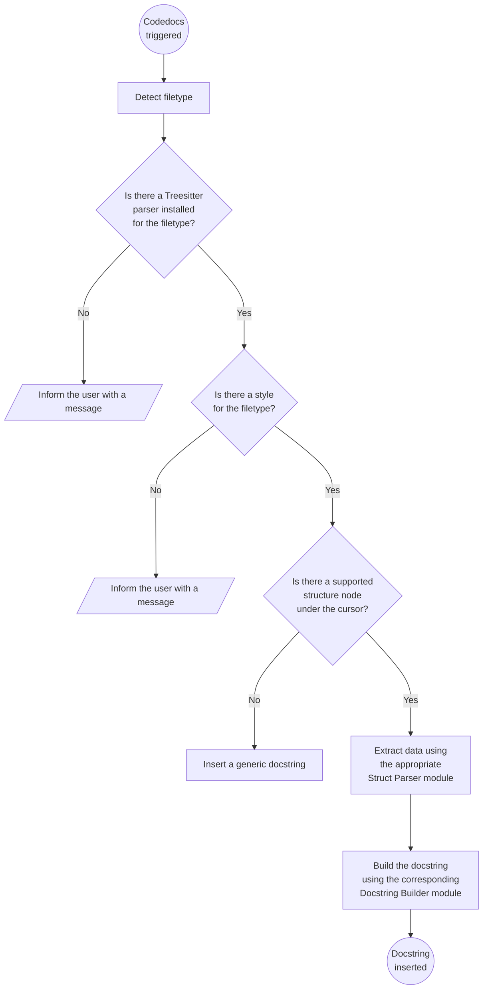

# Codedocs under the hood

Welcome! This document provides an overview of the Codedocs codebase to help you contribute to the project, understand how it works internally, or—let's be honest—to help me when I inevitably forget how things are wired together.

Codedocs is a plugin focused on generating and inserting docstrings for programming language structures. In the context of this plugin, a "structure" refers to any language construct such as functions, methods, classes, or variables.

## Table of contents
- [Logic flow](#logic-flow)

## Logic flow

The following diagram provides a visual representation of the logic flow that takes place each time docstring generation is triggered, whether through a Codedocs command or a keymap.

