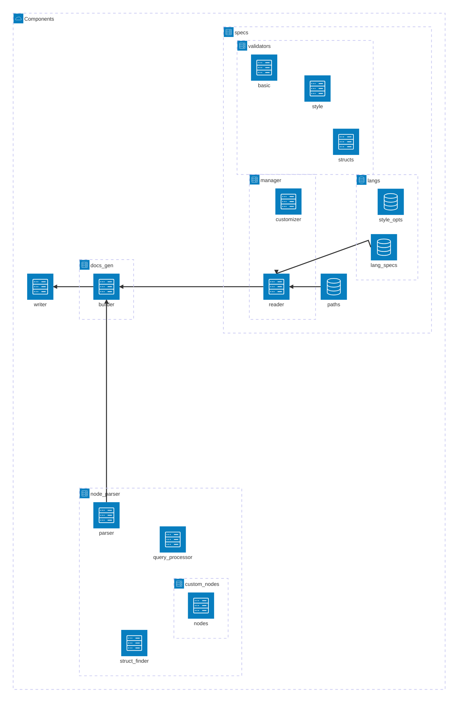
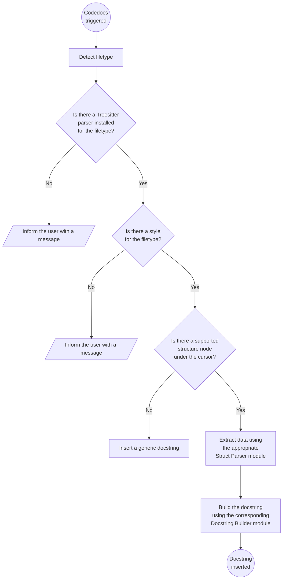

# Technical documentation

Welcome! This document provides an overview of the Codedocs codebase to help you contribute to the project, understand how it works internally, or—let's be honest—to help me when I inevitably forget how things are wired together.

Codedocs is a plugin focused on generating and inserting docstrings for programming language structures. In the context of this plugin, a "structure" refers to any language construct such as functions, methods, classes, or variables.

## Table of contents
- [Components](#components)
- [Logic flow](#logic-flow)

## Components

This a detailed representation of the components and subcomponents that form the plugin:

Here is the documentation for the main components:

- [specs](./specs/README.md)
- [node_parser](./node_parser/README.md)
- docs_gen

## Logic flow

The following diagram provides a visual representation of the logic flow that takes place each time docstring generation is triggered, whether through a Codedocs command or a keymap.

