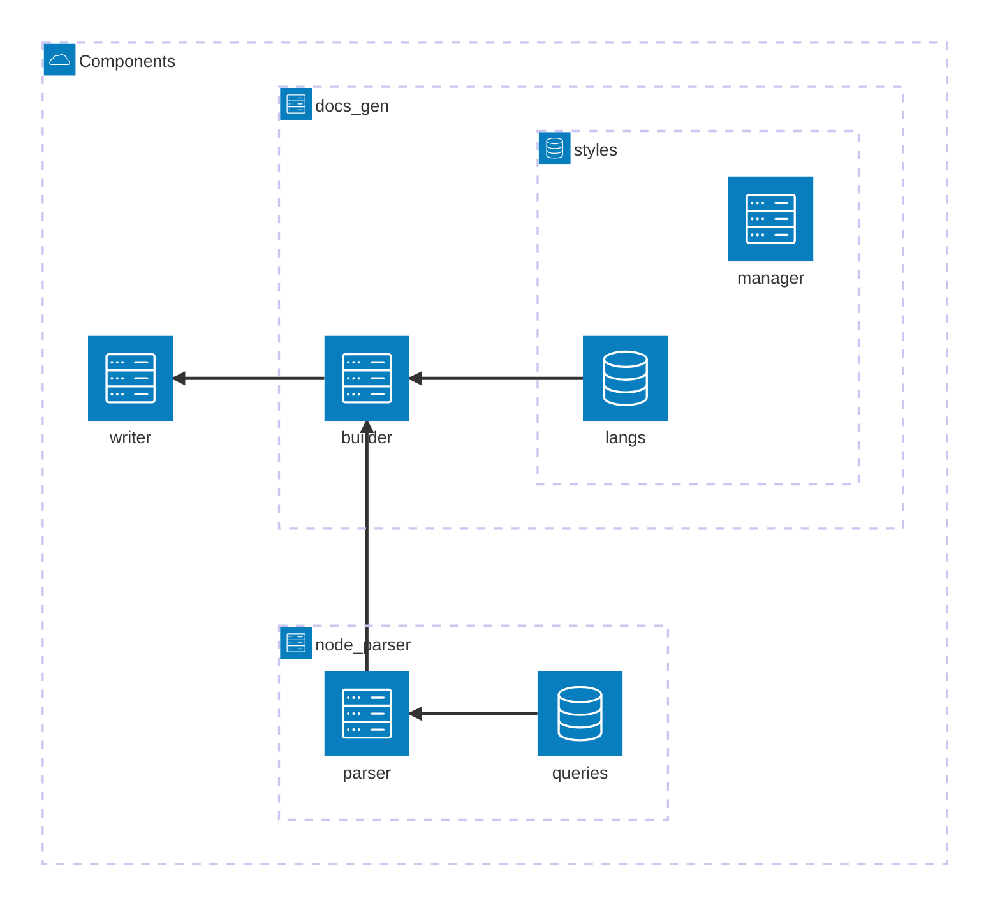
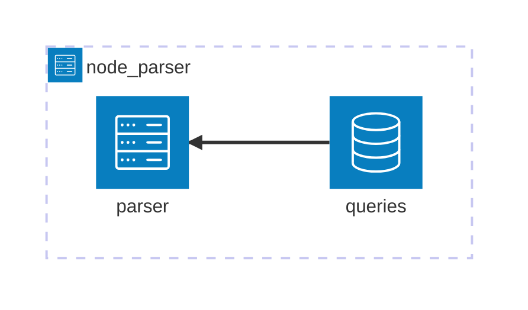
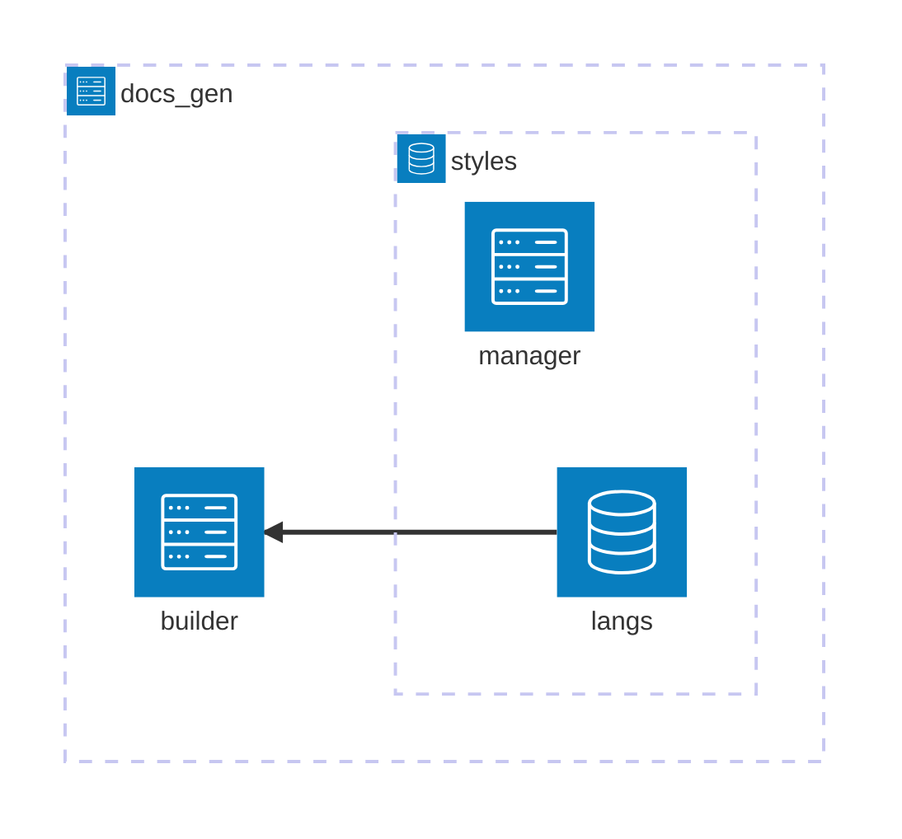
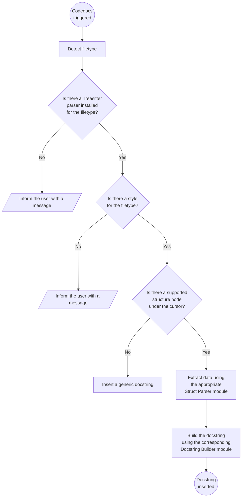

# Technical documentation

Welcome! This document provides an overview of the Codedocs codebase to help you contribute to the project, understand how it works internally, or—let's be honest—to help me when I inevitably forget how things are wired together.

Codedocs is a plugin focused on generating and inserting docstrings for programming language structures. In the context of this plugin, a "structure" refers to any language construct such as functions, methods, classes, or variables.

## Table of contents
- [Components](#components)
- [Logic flow](#logic-flow)

## Components

This a detailed representation of the components and subcomponents that form the plugin:

### `node_parser`

This directory is responsible for parsing Treesitter nodes and extracting specific data from them (e.g., the parameters of a function node).

- **`queries`**: A directory containing files with Treesitter queries for parsing language constructs such as functions, classes, etc.  
- **`parser`**: A module that detects the programming language in the Neovim buffer, parses the corresponding queries from the `queries` directory, and returns specific data based on the parsed queries.

### `docs_gen`

This directory is responsible for generating a docstring using the data provided by the `node_parser` component.

- **`builder`**: A module that constructs a docstring based on the data parsed by `node_parser` and the language-specific settings defined in `langs`.

#### Styles

- **`langs`**: A directory containing modules for various programming languages. Each module includes customizable settings that define the structure and appearance of a docstring for its respective language.  
- **`manager`**: A module dedicated to modifying the settings in the `langs` directory. It is invoked by the `setup` function in the `init` file, allowing users to customize the default language style or specific settings from a particular style.

### `writer`

The writer module is the final step in Codedoc's workflow. It takes the docstring (represented as a table) generated by docs_gen, writes it to the buffer, and positions the cursor at the title's location. The module then enters Insert mode, allowing users to immediately start typing the title of the docstring.

## Logic flow

The following diagram provides a visual representation of the logic flow that takes place each time docstring generation is triggered, whether through a Codedocs command or a keymap.

