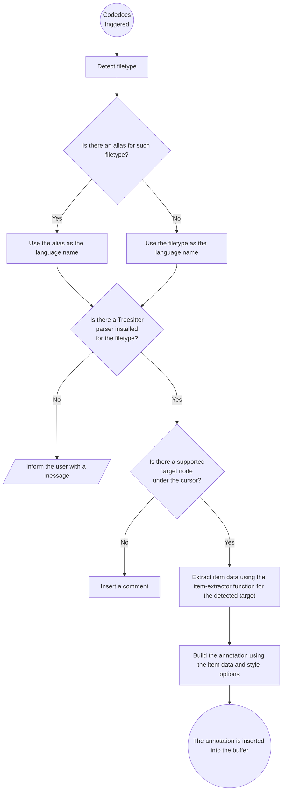

# Technical documentation

Welcome! This document provides an overview of the Codedocs codebase to help you
contribute to the project, understand how it works internally, and to help me
get back on track when I inevitably forget how things are wired together.

In the context of this plugin, a "target" refers to any language construct such
as functions, methods, classes, or variables.

## Table of contents

- [Directory structure](#directory-structure)
- [Logic flow](#logic-flow)
- [Configuration](#configuration)

## Directory structure

```bash
root
├── README.md # User-facing documentation
├── CONTRIBUTING.md
├── LICENSE
├── MAKEFILE # Project commands
├── docs
│   ├── codedocs.txt # `:h codedocs` documentation
│   └── tags # ctags tags for the built-in `:h codedocs` documentation
├── queries
│   └── ... # language directories
│       └── *.scm # Treesitter queries used to extract target items
│── scripts
│   └── *.sh # Miscellaneous scripts that help develop the plugin
│── tests
│   └── * # Directories at any depth
│       └ *_spec.lua # Miscellaneous scripts that help develop the plugin
│── plugin
│   └── codedocs.lua # General plugin setup
└── lua
│   └── codedocs
│       ├── annot_builder.lua # Uses item data and language styles to build an annotation
│       ├── config
│       │   ├── init.lua # Default configuration
│       │   └── languages
│       │       ├── ... # A directory per supported language
│       │       └── utils.lua
│       ├── health.lua # Exposes plugin diagnostics that can be checked using the `:checkhealth` command
│       ├── init.lua # Plugin entry point
│       ├── item_extractor.lua # Extracts items out of a code target
│       ├── README.md # You are here
│       └── utils
│           └── debug_logger.lua # Allows specific data to be displayed for debugging purposes if the `debug` config option is enabled
```

## Logic flow

The following diagram provides a visual representation of the logic flow that
takes place each time docstring generation is triggered, whether through a
Codedocs command or a keymap.


```mermaid
flowchart TB
    1((Codedocs<br>triggered)) --> 2
    2[Detect filetype] --> 3
    3{Is there an alias for such filetype?}
    3 -- No --> 4[Use the filetype as the language name]
    3 -- Yes --> 5[Use the alias as the language name]
    5 --> 6
    4 --> 6
    6{Is there a Treesitter<br>parser installed<br>for the filetype?}
    6 -- No ---> 7[/Inform the user with a message/]
    6 -- Yes ---> 8{Is there a supported<br>target node<br>under the cursor?}
    8 -- No ---> 9[Insert a comment]
    8 -- Yes ---> 10[Extract item data using the item-extractor function for the detected target]
    10 ---> 11[Build the annotation using the item data and style options]
    11 --> 12((The annotation is inserted into the buffer))

```

## Configuration

### Dynamic creation

Unlike other plugins, the configuration table is built dynamically when the
plugin first loads. This is done because many languages are supported, each
language defines many annotation styles, and each style includes a number of
individual annotations. Additionally, most languages implement a set of code
targets.

Creating the table as-is directly in the source code was prone to errors in
early versions because it required a lot of `require` statements, which is why
the dynamic approach was chosen.
