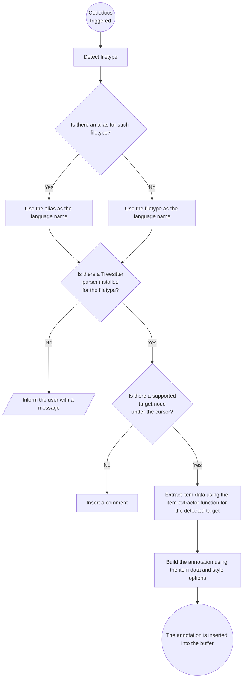

# Technical documentation

Welcome! This document provides an overview of the Codedocs codebase to
help you contribute to the project, understand how it works internally,
and to help me get back on track when I inevitably forget how things are wired
together.

In the context of this plugin, a "target" refers to any language construct
such as functions, methods, classes, or variables.

## Table of contents

- [Directory structure](#directory-structure)
- [Logic flow](#logic-flow)

## Directory structure

```bash
lua
└── codedocs
   ├── annotation_builder.lua # Uses item data and language styles to build an annotation
   ├── config
   │  ├── init.lua # Default configuration
   │  └── languages
   │     ├── ... # A directory per supported language
   │     └── utils.lua
   ├── health.lua # Exposes plugin diagnostics that can be checked using the `:checkhealth` command
   ├── init.lua # Plugin entry point
   ├── item_extractor.lua # Extracts items out of a code target
   ├── lang_specs
   │  ├── init.lua
   │  └── style_opts.lua
   ├── README.md # You are here
   └── utils
      └── debug_logger.lua # Allows specific data to be displayed for debugging purposes if the `debug` config option is enabled
```

## Logic flow

The following diagram provides a visual representation of the logic flow that
takes place each time docstring generation is triggered, whether through a Codedocs
command or a keymap.


```mermaid
flowchart TB
    1((Codedocs<br>triggered)) --> 2
    2[Detect filetype] --> 3
    3{Is there an alias for such filetype?}
    3 -- No --> 4[Use the filetype as the language name]
    3 -- Yes --> 5[Use the alias as the language name]
    5 --> 6
    4 --> 6
    6{Is there a Treesitter<br>parser installed<br>for the filetype?}
    6 -- No ---> 7[/Inform the user with a message/]
    6 -- Yes ---> 8{Is there a supported<br>target node<br>under the cursor?}
    8 -- No ---> 9[Insert a comment]
    8 -- Yes ---> 10[Extract item data using the item-extractor function for the detected target]
    10 ---> 11[Build the annotation using the item data and style options]
    11 --> 12((The annotation is inserted into the buffer))

```
