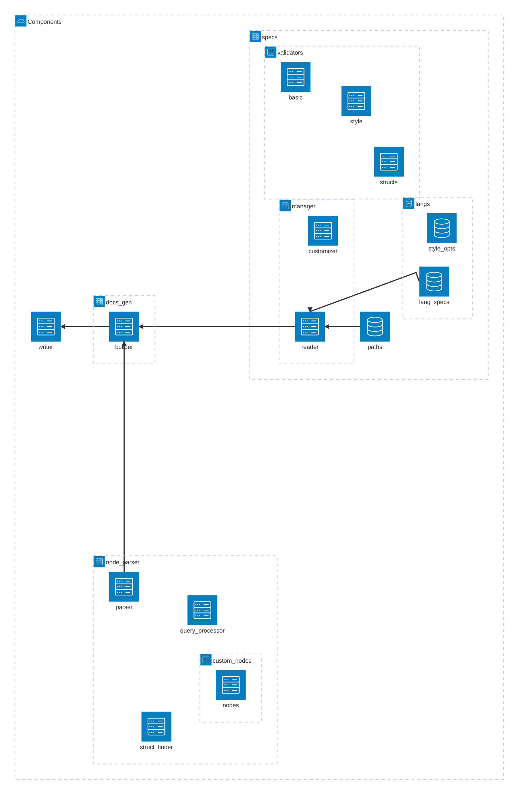
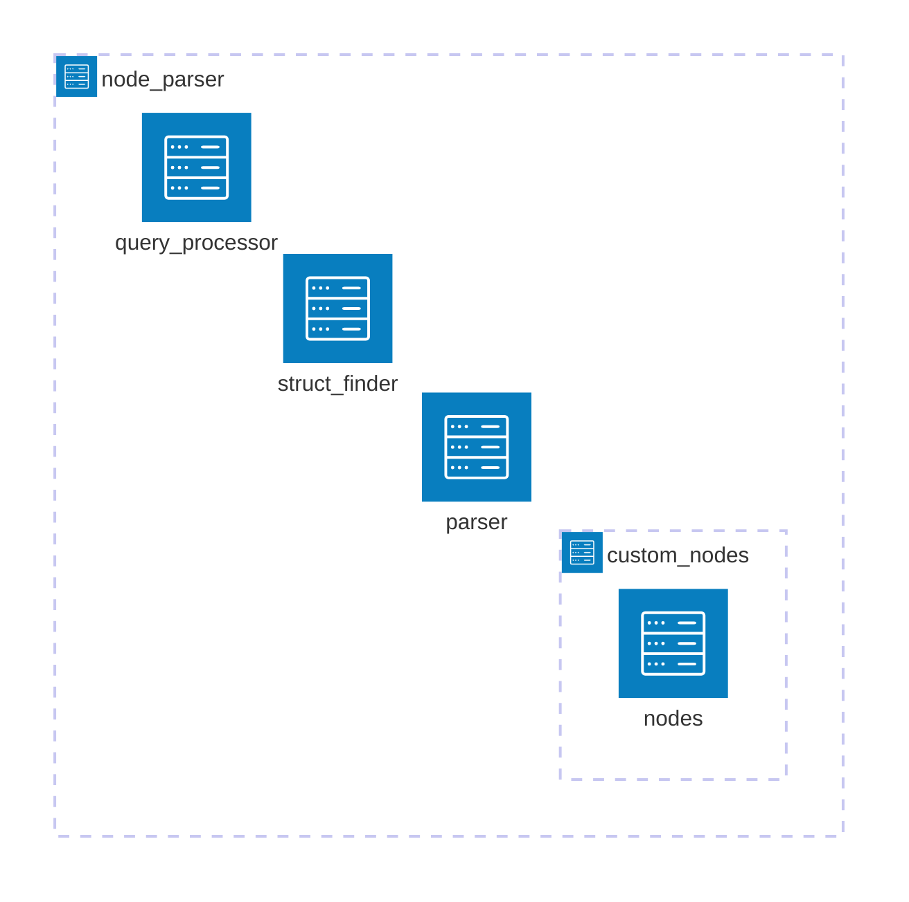
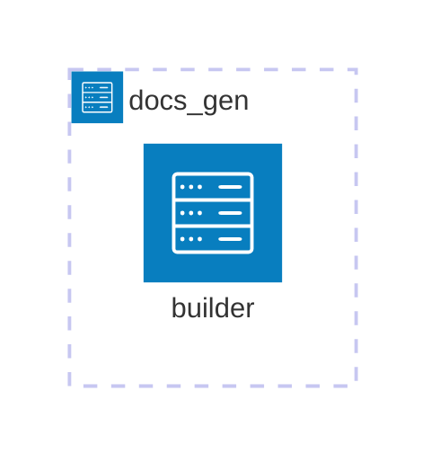

# Technical documentation

Welcome! This document provides an overview of the Codedocs codebase to help you contribute to the project, understand how it works internally, or—let's be honest—to help me when I inevitably forget how things are wired together.

Codedocs is a plugin focused on generating and inserting docstrings for programming language structures. In the context of this plugin, a "structure" refers to any language construct such as functions, methods, classes, or variables.

## Table of contents
- [Components](#components)
- [Logic flow](#logic-flow)

## Components

This a detailed representation of the components and subcomponents that form the plugin:

### `specs`

This directory defines a language's specifications. Each language specification includes:

- **Directories for supported structures** (e.g., functions). Each structure directory contains modules that define style options for a specific style (e.g., JSDoc for a JavaScript function).
- **An `init.lua` file** that provides essential language details, including:
  - **`identifier_pos`**: Determines whether a structure's data identifier appears before its type. For example, in functions, this specifies if a parameter's name precedes its type based on the language's syntax.
  - **`styles`**: A table listing the required styles for all structures. If a structure does not define all listed styles, an error will occur.
  - **`default_style`**: Specifies the default style used when generating a docstring.
  - **`structs`**: A table where each key represents a supported structure. Each structure contains a `node_identifiers` table, which maps to a list of Treesitter node types that correspond to that structure.

### `node_parser`

This directory is responsible for parsing Treesitter nodes and extracting specific data from them.

- **`query_processor`**: A module that processes standard Treesitter queries.  
- **`struct_finder`**: A module that utilizes the `node_identifiers` field from each structure in a language spec to determine which structure is under the cursor.  
- **`custom_nodes`**: A directory containing a `nodes` module, which implements all custom nodes.  
- **`parser`**: A module that processes a spec's custom node tree and returns the resulting data.  

### `docs_gen`

This directory handles the generation of docstrings using data from the `node_parser` component.

- **`builder`**: A module responsible for constructing docstrings. It utilizes the parsed data from `node_parser` and applies the structure-specific style options defined in the language's specification.

### `writer`

The writer module is the final step in Codedoc's workflow. It takes the docstring (represented as a table) generated by docs_gen, writes it to the buffer, and positions the cursor at the title's location. The module then enters Insert mode, allowing users to immediately start typing the title of the docstring.

## Logic flow

The following diagram provides a visual representation of the logic flow that takes place each time docstring generation is triggered, whether through a Codedocs command or a keymap.

