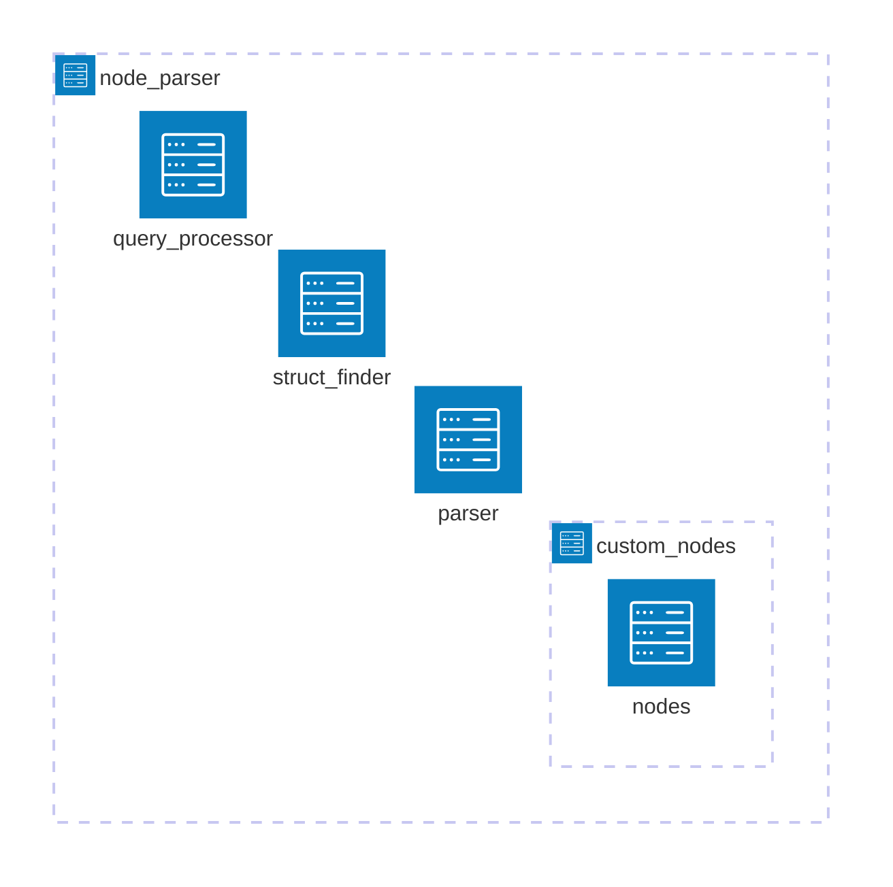

# Node Parser

This component is responsible for parsing a structure's custom node tree
and extracting the data needed to generate a docstring.

---

## What is a Custom Node Tree?

A **custom node tree** is a tree containing multiple nested **custom nodes**
—special constructs designed for Codedocs to enhance the capabilities of
Treesitter queries.

For more details, check out the [technical documentation on custom nodes](./custom_nodes/README.md).

---

## How a Node Tree is Parsed  

A node tree is made up of different types of nodes. Some contain nested nodes,
while others hold Treesitter queries. To handle these structures efficiently,
parsing is split into two key components:  

### `query_processor`

The query_processor module handles **Treesitter queries**, which form the
core of every node tree, regardless of structure.

It processes **two types of queries**, based on their capture names:

- **"item_name"/"item_type"** – Extracts structured data (e.g., function
    parameter details).  
- **"target"** – Returns the matched nodes directly, without additional
    processing.

**Query behavior:**  

- If a query contains **at least one** `"target"` capture, `query_processor`
    returns a table of matched nodes.  
- Otherwise, it returns a table of tables, where each subtable represents
    an extracted item's data.

### `node_processor`

Nodes are processed via the `process_node` function in the `parser` module,
following one of two paths:

1. **Nodes with queries:** If a node contains a Treesitter query, it is passed
    to query_processor, which returns the result.  
2. **Nodes with children:** If a node has children, its respective **"process"
    function** is called recursively.

---

## Parsing Workflow

The process of parsing a structure's custom node tree follows these steps:

1. The **struct_finder** receives a table containing the supported
    structures for a language, along with their associated Treesitter
    node types.
2. If the node under the cursor matches any of the identifiers for
    a structure, the corresponding structure name is returned.
3. The **parser module** takes in the relevant settings and the
    structure's tree, then processes it.
4. After processing the custom node tree, the query_processor runs the
    Treesitter query found in simple nodes.
5. Finally, the processed tree is returned as a table containing
    the extracted data.
