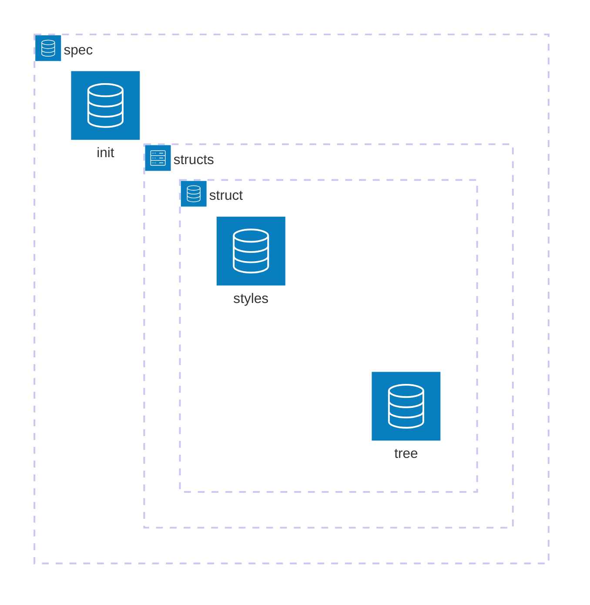

# Specs

This component is a directory that contains language-specific information,
formally known as specifications.

## Structure

A spec follows this structure:

## Overview

Each spec stores its data in the `init.lua` file as a table.  
From here on, we'll refer to each piece of data in a spec as a **field**.

Every spec consists of two types of fields:  

- **Simple fields** – Define key characteristics of the language.  
- **Struct field** – Defines language structures and their corresponding
    Treesitter nodes.

### Simple Fields

These fields describe specific aspects of a language. Every spec must define
the following:

- **identifier_pos**: Indicates the position of an item's name relative to
its type.  
  - Example: In Kotlin, a parameter's name appears before its type,
  so `identifier_pos` for functions is `true`.  
  - In Java, the parameter’s name comes after its type, so `identifier_pos`
  is `false`.  

- **default_style**: Specifies the default style applied to all structures.

- **styles**: Lists all supported styles that every structure in a spec must
implement.

### Struct Field

This field is a table assigned to the `"structs"` key in the spec's table.  

- Each key in this table represents a structure supported by the language.  
- Each structure must have a `"node_identifiers"` key, assigned a table of
Treesitter node types corresponding to that structure.  

If any structure listed in the table is missing an implementation, a warning
will be displayed.

---

## Implementing a Spec

To add a new language spec, follow these steps:

### 1. Define Fields in `init.lua`

Create an `init.lua` file for the language and define all required fields
as explained above.

### 2. Implement Structures and Styles

Each structure must be represented by a directory that contains:

- A **"tree"** module.
- A **"styles"** directory.

#### Styles Directory

The `styles` directory contains modules defining how a structure should be
formatted based on different styles.  
Each module must be named exactly as listed in the `"styles"` field of the spec.

#### Tree File

The `tree` file contains nested custom nodes that will be processed by the
[node_parser component](./../node_parser.README).  
This file determines what data is extracted from Treesitter nodes and how it's retrieved.
