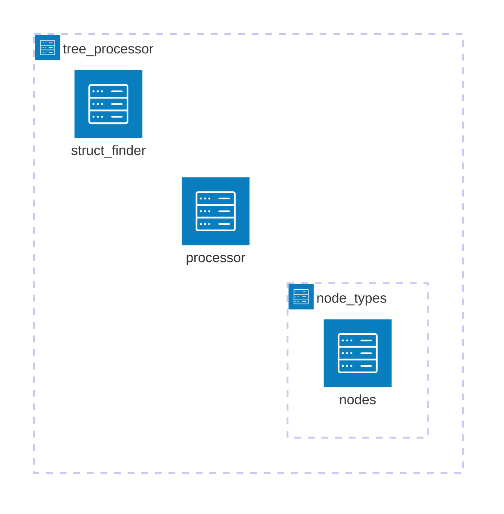

# Tree Processor

This component is responsible for parsing a structure's custom node tree
and extracting the data needed to generate a docstring.

---

## What is a Custom Node Tree?

A **custom node tree** is a tree containing multiple nested **custom nodes**
—special constructs designed for Codedocs to enhance the capabilities of
Treesitter queries.

For more details, check out the [technical documentation on custom nodes](./custom_nodes/README.md).

---

## Obtaining a Node Tree

The process of retrieving a structure's node tree follows these steps:

1. The **struct_finder** receives a table of supported structures for a
    language, mapped to their corresponding Treesitter node types.
2. If the node under the cursor matches any of these identifiers,
    the corresponding structure name is returned.
3. The node tree for that structure is then retrieved from the language
    specification.

---

## How a Node Tree is Parsed

A node tree consists of various types of nodes—some contain nested nodes,
while others hold Treesitter queries. To efficiently process these
structures, the logic is divided into two key functions in the processor
module:

### `get_struct_items`

This function initiates the processing by retrieving each structure's
section tree and calling the `process` method on every node.

The `process` method varies depending on the node type, but in most
cases, it eventually calls the `process_node` function in the processor
module.

### `process_node`

This function processes a node’s child, which can either be:

- A **regular Treesitter query**
- A **custom node**

If the child is a custom node, its `process` method is called, recursively
traversing the node tree.

#### Query Processing

Every node tree, no matter how deeply nested its child nodes are, ultimately
contains Treesitter queries. These queries fall into two main types based on
their capture names:

- **`"target"`** – Returns matched nodes as-is in a flat table.
- **`"item_name"` / `"item_type"`** – Extracts structured data (e.g., function
    parameters, class attributes) and returns it as grouped subtables.

#### Extracting Item Data

The primary goal of a node tree is to retrieve *item data. This means that the
final node in any branch of the tree will always be a query using `"item_name"`
or `"item_type"` as capture names.

Item: A self-contained set of data extracted from a code structure, such as a
function parameter or a class attribute.
